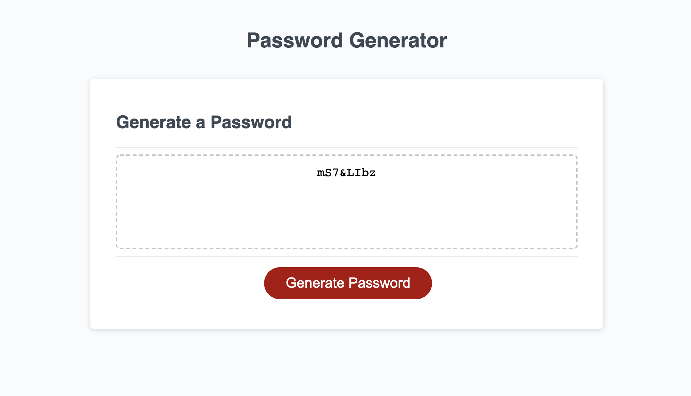

# 03 JavaScript: Password Generator

## Description

Create an application that enables employees to generate random passwords based on criteria that they’ve selected.

## Screenshot

## Links to Application

- Here is the repo: [bgould86/portfolio](https://github.com/bgould86/hw3)
- Here is the pages: [bgould86/pages](https://bgould86.github.io/hw3/)
